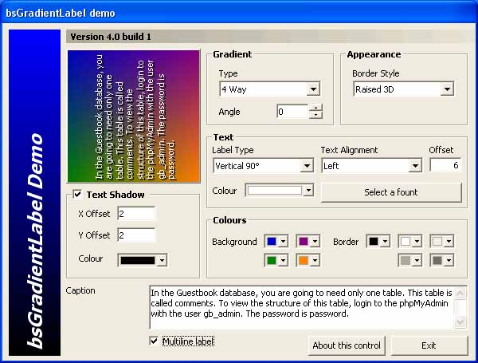



## bsGradientLabel version 4

### Description

Version 4 of the bsGradientLabel control. The code has been rewritten to use the clsGradient class (by Rocky Clark) and Rohit Kulshreshtha's gradient module - it no longer uses msimg32.dll, so Windows 95 users need not complain anymore. Some code redundancy was disposed of too. Also, you can change the angle of two-way gradients. If there are any bugs in the code, please let me know. Enjoy!
 
### More Info
 

             |
---                |---
**Submitted On**   |2004-04-06 16:08:32
**By**             |[Headdy](https://github.com/Planet-Source-Code/PSCIndex/blob/master/ByAuthor/headdy.md)
**Level**          |Advanced
**User Rating**    |4.5 (86 globes from 19 users)
**Compatibility**  |VB 6\.0
**Category**       |[Custom Controls/ Forms/  Menus](https://github.com/Planet-Source-Code/PSCIndex/blob/master/ByCategory/custom-controls-forms-menus__1-4.md)
**World**          |[Visual Basic](https://github.com/Planet-Source-Code/PSCIndex/blob/master/ByWorld/visual-basic.md)
**Archive File**   |[bsGradient173089482004\.zip](https://github.com/Planet-Source-Code/headdy-bsgradientlabel-version-4__1-42993/archive/master.zip)

